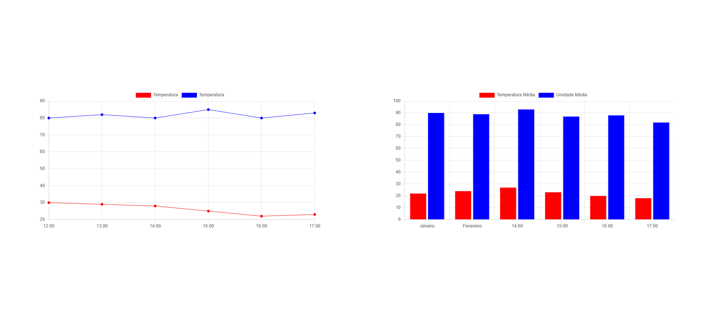

# Graficos com Chartjs

## Tecnologias Utilizadas
- **HTML**: Estruturação das páginas.
- **CSS**: Estilização e layout responsivo.
- **Biblioteca Charjs**: para exibição dos graficos

## Print do Site

